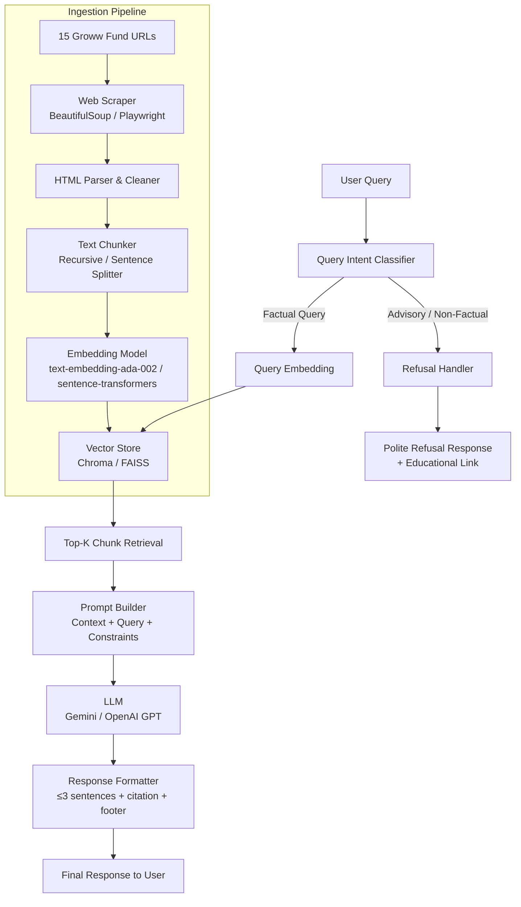
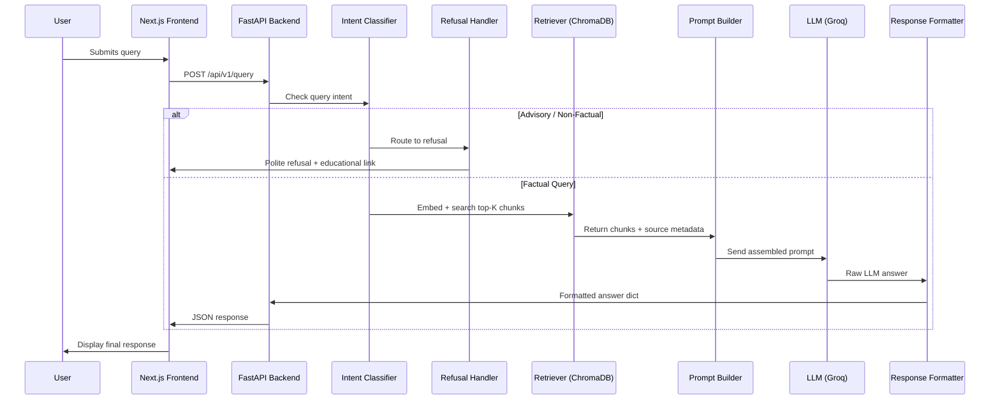
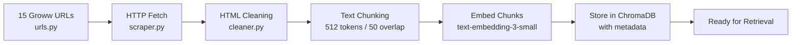

# Architecture: Mutual Fund FAQ Assistant (RAG-GROWW)

---

## 1. System Overview

The RAG-GROWW assistant is a **Retrieval-Augmented Generation (RAG)** pipeline designed to answer strictly factual queries about 15 Navi Mutual Fund schemes. It scrapes official Groww fund pages, builds a vector knowledge base, and generates short, source-cited answers using an LLM — all while refusing advisory or opinion-based queries.

```
User Query
    │
    ▼
┌─────────────────────────────────────────────────────┐
│                    Next.js UI                       │
│                                                     │
│   Client-side interactions & API calls              │
└─────────────────────────────────────────────────────┘
    │
    ▼ (REST API)
┌─────────────────────────────────────────────────────┐
│                    FastAPI Backend                  │
│                                                     │
│  Query → Intent Check → Retriever → LLM → Response │
└─────────────────────────────────────────────────────┘
    │
    ▼
Structured Response (≤3 sentences + 1 citation + footer)
```

---

## 2. High-Level Architecture Diagram



---

## 3. Component Breakdown

### 3.1 Data Ingestion Pipeline

Responsible for scraping, cleaning, chunking, and indexing all 15 fund pages into a vector store.

```
┌──────────────────────────────────────────────────────────────────┐
│                     Data Ingestion Pipeline                      │
│                                                                  │
│  [Groww URLs] → Scraper → HTML Cleaner → Chunker → Embedder     │
│                                                    ↓             │
│                                            Vector Store (Chroma) │
└──────────────────────────────────────────────────────────────────┘
```

| Step | Component | Description |
|---|---|---|
| **URL Loading** | `corpus/urls.py` | Hardcoded list of 15 confirmed Groww fund URLs |
| **Web Scraping** | `BeautifulSoup` / `Playwright` | Fetches rendered HTML from Groww pages |
| **HTML Cleaning** | `corpus/cleaner.py` | Strips nav, ads, scripts; extracts fund metadata sections |
| **Text Chunking** | `LangChain RecursiveCharacterTextSplitter` | Splits into 512-token chunks with 50-token overlap |
| **Embedding** | `BAAI/bge-base-en-v1.5` (BGE via `sentence-transformers`) | Local, free, high-quality dense vector generation |
| **Indexing** | `ChromaDB` | Persists vectors with metadata (fund name, source URL, scraped date) |

#### Metadata Schema (per chunk)

```json
{
  "category": "Large Cap / Index",
  "source_url": "https://groww.in/mutual-funds/navi-nifty-50-index-fund-direct-growth",
  "scraped_at": "2026-07-06",
  "chunk_id": "navi-nifty-50-chunk-003"
}
```

---

### 3.1.1 Automated Ingestion Scheduler

To keep the vector store completely up to date with the latest Nav values, expense ratios, and fund details, the ingestion pipeline is executed automatically using **GitHub Actions**.

| Parameter | Value |
|---|---|
| **Platform** | GitHub Actions |
| **Trigger** | Scheduled Cron (`30 4 * * *`) -> 10:00 AM IST daily |
| **Workflow Action** | Sets up Python environment and runs the ingestion script |
| **Output** | Automatically updates the ChromaDB vector files |

---

### 3.2 Query Intent Classifier

A lightweight guard layer that runs **before** retrieval to detect advisory or non-factual queries and short-circuit them to the refusal handler.

```
Query Input
    │
    ▼
┌──────────────────────────────────────┐
│         Intent Classifier            │
│                                      │
│  Rule-based keywords  +  LLM prompt  │
│  (fast, low-cost first pass)         │
└──────────────────────────────────────┘
    │                   │
  FACTUAL           ADVISORY / VAGUE
    │                   │
  Retriever         Refusal Handler
```

**Advisory trigger keywords (examples):**
- `should I`, `better fund`, `recommend`, `invest in`, `which is best`, `compare returns`, `buy`, `sell`

**Classification approach:**
- **Primary:** Rule-based keyword matching (zero latency)
- **Fallback:** Short LLM call with a classification prompt for ambiguous queries

---

### 3.3 Retriever

Performs semantic similarity search over the vector store to find the most relevant chunks for a given factual query.

| Parameter | Value |
|---|---|
| **Vector Store** | ChromaDB (persistent, local) |
| **Search Type** | Cosine similarity |
| **Top-K Chunks** | 3–5 most relevant |
| **Metadata Filter** | Optional: filter by fund name if user specifies a scheme |

**Retrieval flow:**

```
Query String
    │
    ▼
Embed Query → Search Chroma → Return Top-K Chunks + Source Metadata
```

---

### 3.4 Prompt Builder

Assembles the final prompt sent to the LLM, enforcing all response constraints defined in the problem statement.

```
┌──────────────────────────────────────────────────────────────┐
│                        Prompt Template                       │
│                                                              │
│  SYSTEM: You are a facts-only mutual fund FAQ assistant...   │
│           Answer in max 3 sentences.                         │
│           Include exactly one source link.                   │
│           Never provide investment advice.                   │
│                                                              │
│  CONTEXT: {retrieved_chunks}                                 │
│                                                              │
│  QUESTION: {user_query}                                      │
│                                                              │
│  ANSWER:                                                     │
└──────────────────────────────────────────────────────────────┘
```

**System prompt constraints enforced:**
- Max 3 sentences
- Exactly one citation link from the retrieved source metadata
- `"Last updated from sources: <scraped_date>"` footer appended automatically
- No comparisons, no return calculations, no personal advice

---

### 3.5 LLM (Generation Layer)

The project uses **[Groq](https://groq.com/)** as the LLM provider, accessed via the `groq` Python SDK. Groq delivers ultra-low latency inference on open-source models using its custom LPU hardware.

| Parameter | Value |
|---|---|
| **Provider** | Groq Cloud API |
| **Model** | `llama-3.3-70b-versatile` (primary) |
| **Fallback Model** | `llama-3.1-8b-instant` (lower latency, lighter) |
| **Temperature** | `0.0` (deterministic, minimizes hallucination) |
| **Max Tokens** | `256` (enforces ≤3 sentence constraint) |
| **API Key** | Stored in `.env` as `GROQ_API_KEY` |

LLM is called only with the assembled prompt from the Prompt Builder. Temperature is set to `0.0` to minimize hallucination and enforce factual, deterministic responses.

---

### 3.6 Response Formatter

Post-processes the LLM output before returning it to the user.

```python
def format_response(llm_output: str, source_url: str, scraped_date: str) -> dict:
    return {
        "answer": llm_output.strip(),
        "citation": source_url,
        "footer": f"Last updated from sources: {scraped_date}",
        "disclaimer": "Facts-only. No investment advice."
    }
```

**Output structure:**

```
[Answer — max 3 sentences]

Source: https://groww.in/mutual-funds/navi-nifty-50-index-fund-direct-growth
Last updated from sources: 2026-07-06
Facts-only. No investment advice.
```

---

### 3.7 Refusal Handler

Intercepts advisory or vague queries and returns a polite, structured refusal.

```python
def refusal_response(query: str) -> dict:
    return {
        "answer": "This assistant provides factual information only and cannot offer investment advice or fund recommendations.",
        "educational_link": "https://www.amfiindia.com/investor-corner/knowledge-center",
        "disclaimer": "Facts-only. No investment advice."
    }
```

**Refusal trigger examples:**

| Query | Reason |
|---|---|
| *"Should I invest in Navi Flexi Cap?"* | Investment advice |
| *"Which fund has better returns?"* | Performance comparison |
| *"Is Navi a safe AMC?"* | Opinion / recommendation |
| *"What should I do with my SIP?"* | Advisory |

---

## 4. Technology Stack

| Layer | Technology | Rationale |
|---|---|---|
| **Language** | Python 3.11+ | Ecosystem support for RAG (LangChain, ChromaDB) |
| **Web Scraping** | `BeautifulSoup4` + `httpx` / `Playwright` | Static + JS-rendered page support |
| **Text Chunking** | `LangChain` `RecursiveCharacterTextSplitter` | Context-preserving chunking |
| **Embedding Model** | `BAAI/bge-base-en-v1.5` via `sentence-transformers` | Local BGE model, no API cost, strong retrieval accuracy |
| **Vector Store** | `ChromaDB` (local persistent) | Lightweight, no infra required |
| **LLM** | `llama-3.3-70b-versatile` via **Groq** API | Ultra-low latency inference, free tier available |
| **Orchestration** | `LangChain` | RAG chain assembly |
| **Backend API** | `FastAPI` + `Uvicorn` | Exposes REST API for frontend |
| **UI** | `Next.js` / React | Modern, rich aesthetic web application |
| **Environment** | `python-dotenv` | API key management |
| **Dependency Mgmt** | `pip` + `requirements.txt` | Reproducible installs |

---

## 5. Project Directory Structure

```
RAG-GROWW/
│
├── docs/
│   ├── problemStatement.md       # Project requirements
│   └── architecture.md           # This file
│
├── corpus/
│   ├── urls.py                   # 15 confirmed Groww fund URLs
│   ├── scraper.py                # Web scraper (BeautifulSoup / Playwright)
│   ├── cleaner.py                # HTML parser and text extractor
│   └── ingest.py                 # Chunking + embedding + Chroma indexing
│
├── rag/
│   ├── retriever.py              # Vector store query logic
│   ├── classifier.py             # Intent / refusal classifier
│   ├── prompt_builder.py         # Prompt template assembly
│   ├── generator.py              # LLM call wrapper
│   └── formatter.py              # Response post-processor
│
├── app/
│   └── api.py                    # FastAPI backend entry point
│
├── frontend/                     # Next.js web application
│
├── data/
│   └── chroma_db/                # Persisted ChromaDB vector store
│
├── .env                          # API keys (not committed)
├── requirements.txt              # Python dependencies
└── README.md                     # Setup and usage guide
```

---

## 6. Data Flow: End-to-End



---

## 7. Ingestion Pipeline: Step-by-Step



**When to re-run ingestion:**
- When Groww fund pages are updated (NAV, expense ratio changes, etc.)
- When adding new fund URLs to the corpus
- Recommended: scheduled re-scrape every 30 days

---

## 8. Response Format Specification

Every successful factual answer **must** follow this exact structure:

```
┌─────────────────────────────────────────────────────────────────┐
│  Answer (max 3 sentences, factual only)                         │
│                                                                 │
│  Source: <exact URL of the retrieved document>                  │
│  Last updated from sources: <YYYY-MM-DD>                        │
│  Facts-only. No investment advice.                              │
└─────────────────────────────────────────────────────────────────┘
```

**Example:**

> The expense ratio of Navi Nifty 50 Index Fund – Direct Growth is 0.06% per annum, making it one of the lowest-cost index funds in its category. The fund tracks the Nifty 50 index and does not charge any exit load. Minimum SIP amount is ₹10 per month.
>
> Source: https://groww.in/mutual-funds/navi-nifty-50-index-fund-direct-growth
> Last updated from sources: 2026-07-06
> *Facts-only. No investment advice.*

---

## 9. UI Design (Next.js)

```
┌──────────────────────────────────────────────────────┐
│   🤖 Navi Mutual Fund FAQ Assistant                  │
│   Facts-only. No investment advice.                  │
├──────────────────────────────────────────────────────┤
│  Example Questions (Interactive Cards):              │
│  • What is the expense ratio of Navi Nifty 50?       │
│  • What is the exit load for Navi ELSS fund?         │
│  • What is the minimum SIP for Navi Liquid Fund?     │
├──────────────────────────────────────────────────────┤
│  [Chat history area]                                 │
│                                                      │
│  > User: What is the ELSS lock-in period?            │
│  > Bot: The ELSS lock-in period is 3 years...        │
│          Source: <link>                              │
│          Last updated: 2026-07-06                    │
├──────────────────────────────────────────────────────┤
│  [Input box]                        [Send Button]   │
└──────────────────────────────────────────────────────┘
```

**UI Requirements:**

| Element | Details |
|---|---|
| **Aesthetics** | Dark mode, glassmorphism, micro-animations, modern typography |
| **Welcome Message** | Introduces the assistant and its facts-only scope |
| **Example Questions** | 3 pre-filled clickable example queries |
| **Disclaimer Banner** | Always visible: `"Facts-only. No investment advice."` |
| **Chat Interface** | Message history with user/bot bubbles |
| **Fund Selector (optional)** | Dropdown to filter by specific Navi fund |

---

## 10. Privacy & Security Design

| Concern | Mitigation |
|---|---|
| **No PII collection** | UI has no login, no forms for personal data |
| **No sensitive data storage** | ChromaDB stores only scraped public text + metadata |
| **API key safety** | All keys stored in `.env`, never committed to Git |
| **No session logging** | Chat history lives in frontend state (React) only |
| **Source restriction** | Scraper whitelist hardcoded to 15 official Groww URLs only |

---

## 11. Known Limitations

| Limitation | Impact | Mitigation |
|---|---|---|
| Groww pages may have JS-rendered content | Scraper may miss dynamic sections | Use Playwright for JS rendering |
| NAV and prices change daily | Responses may be slightly stale | Add scrape date to every response footer |
| LLM may hallucinate despite RAG grounding | Incorrect facts returned | Set temperature=0, add strict system prompt |
| Corpus is limited to 15 funds | Cannot answer about other Navi or non-Navi funds | Clearly state scope in UI welcome message |
| No real-time data | Cannot answer live NAV queries accurately | Redirect NAV queries to official Groww/AMC page |

---

## 12. Compliance Checklist

- [x] Only official public URLs used (Groww — AMC-licensed platform)
- [x] No PAN, Aadhaar, account numbers, OTPs processed
- [x] Investment advice explicitly refused
- [x] Performance comparisons explicitly refused
- [x] Every response includes source citation
- [x] Every response includes last-updated date footer
- [x] Disclaimer visible on every response and in UI

---

> **Disclaimer:** *Facts-only. No investment advice.*
