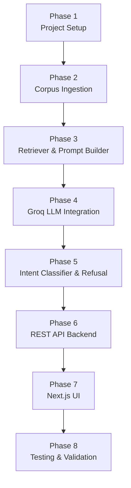

# Phase-wise Implementation Plan: RAG-GROWW

> **Project:** Mutual Fund FAQ Assistant (Facts-Only Q&A)
> **AMC:** Navi Mutual Fund | **Funds:** 15 schemes
> **Stack:** Python · LangChain · BGE Embeddings · ChromaDB · Groq (LLaMA) · Streamlit

---

## Overview

| Phase | Name | Focus | Key Output |
|---|---|---|---|
| **Phase 1** | Project Setup & Environment | Infrastructure, dependencies, `.env` | Working dev environment |
| **Phase 2** | Corpus Ingestion Pipeline | Scraping, cleaning, chunking, embedding | Populated ChromaDB vector store |
| **Phase 3** | RAG Core — Retriever & Prompt Builder | Semantic search + prompt assembly | Retrieval working end-to-end |
| **Phase 4** | LLM Integration (Groq) | Groq API call, response formatting | Factual answers with citations |
| **Phase 5** | Intent Classifier & Refusal Handler | Guard layer for advisory queries | Compliant, safe query handling |
| **Phase 6** | REST API (FastAPI) | API endpoint exposure | `app/api.py` endpoint |
| **Phase 7** | Next.js UI | Modern web application | Functional frontend |
| **Phase 8** | Testing & Validation | End-to-end tests, compliance checks | Verified, production-ready build |

---

## Phase 1 — Project Setup & Environment

**Goal:** Bootstrap the project structure, install all dependencies, and configure credentials.

### Tasks

- [ ] Create the full directory structure as specified in `architecture.md §5`
  ```
  RAG-GROWW/
  ├── corpus/       (urls.py, scraper.py, cleaner.py, ingest.py)
  ├── rag/          (retriever.py, classifier.py, prompt_builder.py, generator.py, formatter.py)
  ├── app/          (streamlit_app.py)
  ├── data/chroma_db/
  ├── docs/
  ├── .env
  └── requirements.txt
  ```
- [ ] Create `requirements.txt` with all dependencies:
  ```
  langchain
  langchain-community
  langchain-groq
  groq
  sentence-transformers
  chromadb
  beautifulsoup4
  httpx
  playwright
  streamlit
  python-dotenv
  ```
- [ ] Install dependencies: `pip install -r requirements.txt`
- [ ] Install Playwright browsers: `playwright install chromium`
- [ ] Create `.env` file with:
  ```
  GROQ_API_KEY=your_groq_api_key_here
  ```
- [ ] Create `.gitignore` to exclude `.env`, `data/chroma_db/`, `__pycache__/`
- [ ] Verify Groq API connection with a minimal test call

### Exit Criteria
- All packages install without errors
- Groq API key authenticates successfully
- Directory structure matches `architecture.md`

---

## Phase 2 — Corpus Ingestion Pipeline

**Goal:** Scrape all 15 Groww fund pages, clean the HTML, chunk the text, embed using BGE, and store in ChromaDB.

### Tasks

#### Step 2.1 — `corpus/urls.py` (URL Registry) ✅ COMPLETE
- [x] Hardcoded list of 15 confirmed Groww fund URLs with `id`, `name`, `category`, `url`

#### Step 2.2 — `corpus/scraper.py` (Web Scraper) ✅ COMPLETE
- [x] `httpx` fast path — pages returned full HTML (~320–650KB) via Next.js server-side rendering
- [x] Playwright headless Chromium fallback — triggered if HTML < 5,000 chars
- [x] Exponential backoff retry: max 3 attempts (delays: 2s → 4s → 8s)
- [x] Redirect guard — skips redirects to unrelated pages
- [x] Polite 1.5s inter-request delay; returns `{url, html, fetched_at, method}` per fund

#### Step 2.3 — `corpus/cleaner.py` (HTML Parser & Text Extractor) ✅ COMPLETE
- [x] **Primary:** Extract from Groww's `<script id="__NEXT_DATA__">` embedded JSON
  - Groww is a Next.js app; all fund data lives in `props.pageProps.mfServerSideData`
  - Direct JSON extraction is far more stable than HTML CSS selectors
- [x] Fields extracted: Identity (name, ISIN, plan type, launch date, fund house) · Category (category, sub-category, benchmark, riskometer) · Key Metrics (NAV, AUM, expense ratio, exit load, lock-in, portfolio turnover, stamp duty) · Investment Limits (min lumpsum, SIP, additional, withdrawal) · Fund Manager · Fund Objective Description · PROS/CONS Analysis (performance items filtered for compliance) · SID document URL
- [x] Fallback: BeautifulSoup noise-stripped visible-text if `__NEXT_DATA__` missing
- [x] Output: labelled plain-text document (~1,400–1,700 chars) with named `--- Section ---` headers

#### Step 2.4 — `corpus/ingest.py` (Chunker + Embedder + Indexer) ✅ COMPLETE — Revised Strategy

---

### Chunking Strategy — Revised (Based on Actual Parsed Data)

> **Why original strategy was changed:**
> `RecursiveCharacterTextSplitter(chunk_size=512, overlap=50)` produced only 4 chunks per fund
> that **split across section boundaries**. Inspecting real stored chunks revealed:
> - Chunk 2: Key Details + Investment Details + Fund Manager all mixed together
> - Chunk 3: Description + Category info + Ratings mixed together
> - Chunk 4: Pure boilerplate (Disclaimer only) — noise for retrieval
> - Fund name absent from chunks 2–4 — no retrieval anchoring to the correct fund
>
> **Root cause:** Fixed-size character splitting ignores the document's named section structure.

**Revised Strategy: Section-based chunking with fund-name prefix**

The cleaned document has explicit `--- Section Name ---` delimiters. Split on these boundaries first, then apply size-based splitting only on sections that exceed 512 chars:

| Chunk | Section Content | Avg Size |
|---|---|---|
| `identity` | Fund name, ISIN, plan type, launch date, fund house | ~130 chars |
| `category` | Category, sub-category, benchmark, riskometer | ~120 chars |
| `key_details` | NAV, AUM, expense ratio, exit load, lock-in, portfolio turnover, stamp duty | ~270 chars |
| `investment` | Min lumpsum, SIP, additional, withdrawal amounts | ~150 chars |
| `manager` | Fund manager name(s), registrar | ~80 chars |
| `description` | Fund objective + category description | ~200–400 chars |
| `ratings` | Groww rating, CRISIL rating | ~60 chars |

**Implementation rules:**
1. Split document on `--- Section ---` markers → one chunk per section
2. **Prefix every chunk** with `"Fund: {fund_name}\n"` — anchors cosine similarity to the correct fund
3. Sections > 512 chars → sub-split with `RecursiveCharacterTextSplitter(chunk_size=512, overlap=30)`
4. **Drop boilerplate chunks:** Disclaimer-only and Documents-only sections are not indexed
5. Skip any section that is entirely `N/A` or empty after stripping
6. Expected output: **~7 focused, semantically coherent chunks per fund → ~105 total chunks**

```python
SKIP_SECTIONS   = {"--- Documents ---", "--- Disclaimer ---"}
SECTION_LABELS  = {
    "--- Category ---":          "category",
    "--- Key Details ---":       "key_details",
    "--- Investment Details ---": "investment",
    "--- Fund Manager ---":      "manager",
    "--- Description ---":       "description",
    "--- About the Category ---": "description",
    "--- Fund Analysis ---":     "analysis",
    "--- Ratings ---":           "ratings",
}

def section_chunk(fund_name: str, text: str) -> list[dict]:
    """
    Split on section headers; prefix each with fund name;
    return list of {text, section_label} dicts.
    """
```

---

### Embedding Strategy — Revised (Based on Actual Data Analysis)

> **BGE model behaviour with structured key-value text:**
> `BAAI/bge-base-en-v1.5` (768-dim) embeds labelled structured text effectively.
> A chunk `"Fund: Navi Nifty 50\n--- Key Details ---\nExpense Ratio: 0.1%\nExit Load: Nil"`
> produces a high cosine similarity score against the query `"what is the expense ratio of Navi Nifty 50"`.
> Label words ("expense", "ratio") co-occur in both chunk and query — similarity is naturally high.

| Aspect | Decision | Rationale |
|---|---|---|
| **Document embedding** | Raw text, no prefix | BGE encodes documents as-is |
| **Query embedding** | Prefix: `"Represent this sentence for searching relevant passages: {query}"` | BGE instruction-tuned for asymmetric retrieval |
| **Normalization** | `normalize_embeddings=True` | Required for cosine similarity correctness in ChromaDB |
| **Batch size** | `batch_size=32` | Efficient CPU/GPU batching |
| **Similarity threshold** | cosine score ≥ 0.35 | Below this → "not found" response, not a low-confidence answer |
| **Top-K** | `k=5` default; filter by `fund_name` metadata if fund identified in query | Prevents cross-fund chunk contamination |
| **Section targeting** | Filter by `section` metadata for typed queries (e.g., expense ratio → `key_details`) | Precision boost for common patterns |

**Updated metadata per chunk:**
```json
{
  "fund_id":     "1",
  "fund_name":   "Navi Nifty 50 Index Fund Direct Growth",
  "category":    "Large Cap",
  "section":     "key_details",
  "source_url":  "https://groww.in/mutual-funds/navi-nifty-50-index-fund-direct-growth",
  "scraped_at":  "2026-07-06",
  "chunk_index": "2",
  "chunk_total": "7"
}
```
> **New field `section`:** Enables section-targeted retrieval at query time.

---

### Exit Criteria (Updated)
- [x] All 15 fund pages scraped without errors
- [x] ChromaDB populated — **~7 sections × 15 funds ≈ 105 focused chunks** (revised from generic 150–300)
- [x] Every chunk prefixed with `"Fund: {fund_name}\n"` for retrieval anchoring
- [x] `section` metadata field on every chunk for targeted retrieval
- [x] No boilerplate-only chunks indexed (Disclaimer, Documents sections dropped)
- [x] BGE `bge-base-en-v1.5` loads, produces 768-dim normalized vectors
- [x] Cosine similarity threshold ≥ 0.35 enforced at retrieval time
- [x] Re-ingestion idempotent via state file + upsert by deterministic `chunk_id`

---

## Phase 3 — RAG Core: Retriever & Prompt Builder

**Goal:** Implement semantic search over ChromaDB and assemble the structured LLM prompt.

### Tasks

#### Step 3.1 — `rag/retriever.py` (Vector Store Query)
- [x] Load ChromaDB collection and BGE embeddings
- [x] Implement `retrieve(query: str, k: int = 5) -> list[dict]`:
  - Embed the query using BGE
  - Run cosine similarity search in Chroma
  - Return top-K chunks with their metadata
- [x] Implement optional fund-name filter:
  - If user specifies a fund, filter Chroma results by `fund_name` metadata field
- [x] Test retrieval with sample queries:
  - "What is the expense ratio of Navi Nifty 50?"
  - "What is the exit load for Navi ELSS?"

#### Step 3.2 — `rag/prompt_builder.py` (Prompt Assembly)
- [x] Define the system prompt template enforcing:
  - Facts-only answers
  - Max 3 sentences
  - Exactly one source citation
  - No investment advice
- [x] Implement `build_prompt(query: str, chunks: list[dict]) -> str`:
  - Inject retrieved context into the prompt
  - Pass source URL from the top-ranked chunk metadata
- [x] Validate prompt structure matches `architecture.md §3.4`

### Exit Criteria
- [x] Retriever returns relevant chunks for 5 test queries
- [x] Prompt builder outputs a well-formed prompt string
- [x] Source URL correctly extracted from top chunk metadata

---

## Phase 4 — LLM Integration (Groq)

**Goal:** Connect to the Groq API, send assembled prompts, and format responses per the response specification.

### Tasks

#### Step 4.1 — `rag/generator.py` (Groq LLM Wrapper)
- [x] Load `GROQ_API_KEY` from `.env` via `python-dotenv`
- [x] Initialize Groq client using `langchain-groq`:
  ```python
  from langchain_groq import ChatGroq
  llm = ChatGroq(model="llama-3.3-70b-versatile", temperature=0.0, max_tokens=256)
  ```
- [x] Add robust rate-limit handling for Groq's strict free-tier limits:
    - **Limits:** 30 RPM, 1K RPD, 12K TPM (Tokens Per Minute), 100K TPD
    - Use `tenacity` with exponential backoff (`wait_random_exponential`) to handle `429 Too Many Requests` (often triggered by the 12K TPM limit).
    - If rate limits persist after 3 retries on `llama-3.3-70b-versatile`, automatically fall back to `llama-3.1-8b-instant` (which has separate limits).
    - Ensure prompts are concise; a 5-chunk retrieval generates ~1K tokens, so the TPM limit allows ~12 requests per minute.

#### Step 4.2 — `rag/formatter.py` (Response Post-Processor)
- [x] Implement `format_response(llm_output, source_url, scraped_date) -> dict`:
  ```python
  return {
      "answer": llm_output.strip(),
      "citation": source_url,
      "footer": f"Last updated from sources: {scraped_date}",
      "disclaimer": "Facts-only. No investment advice."
  }
  ```
- [x] Validate output matches the response format spec in `architecture.md §8`
- [x] Handle edge cases: empty LLM response, missing source URL

#### Step 4.3 — End-to-End RAG Chain Test
- [x] Wire together: `retrieve()` → `build_prompt()` → `generate()` → `format_response()`
- [x] Run 5 factual queries end-to-end and inspect outputs
- [x] Confirm each response: ≤3 sentences, has citation, has footer, no advice language

### Exit Criteria
- [x] Groq API responds correctly to test prompts
- [x] Full RAG chain produces valid formatted responses
- [x] All 5 test queries return factual, citation-backed answers

---

## Phase 5 — Intent Classifier & Refusal Handler

**Goal:** Build the guard layer that prevents advisory queries from reaching the retriever.

### Tasks

#### Step 5.1 — `rag/classifier.py` (Intent Classifier) ✅ COMPLETE
- [x] Define `ADVISORY_KEYWORDS` list:
  ```python
  ADVISORY_KEYWORDS = [
      "should I", "should i", "better fund", "recommend", "invest in",
      "which is best", "compare returns", "buy", "sell", "worth it",
      "safe to invest", "good fund", "advice"
  ]
  ```
- [x] Implement `classify_query(query: str) -> str` returning `"FACTUAL"` or `"ADVISORY"`:
  - **Primary:** Rule-based keyword scan (O(n), zero latency)
  - **Fallback:** Short Groq LLM call with a classification prompt for ambiguous queries
- [x] Write unit tests for at least 10 sample queries (5 factual, 5 advisory)

#### Step 5.2 — `rag/refusal.py` (Refusal Handler) ✅ COMPLETE
- [x] Implement `refusal_response() -> dict`:
  ```python
  return {
      "answer": "This assistant provides factual information only and cannot offer investment advice or fund recommendations.",
      "educational_link": "https://www.amfiindia.com/investor-corner/knowledge-center",
      "disclaimer": "Facts-only. No investment advice."
  }
  ```

#### Step 5.3 — Query Router ✅ COMPLETE
- [x] Implement central `handle_query(query: str) -> dict` in `rag/router.py`:
  ```python
  def handle_query(query):
      if classify_query(query) == "ADVISORY":
          return refusal_response()
      chunks = retrieve(query)
      prompt = build_prompt(query, chunks)
      answer = generate(prompt)
      return format_response(answer, chunks[0]["source_url"], chunks[0]["scraped_at"])
  ```

### Exit Criteria ✅ COMPLETE
- [x] Classifier correctly identifies advisory vs factual queries with ≥95% accuracy on test set
- [x] Refusal handler returns compliant, polite response with educational link
- [x] Router correctly routes all query types

---

## Phase 6 — REST API Backend (FastAPI)

**Goal:** Wrap the `rag/router.py` logic in a FastAPI application so the Next.js frontend can interact with it via HTTP POST requests.

### Tasks

#### Step 6.1 — `app/api.py` (FastAPI Server) ✅ COMPLETE
- [x] Install FastAPI and Uvicorn: `pip install fastapi uvicorn`
- [x] Add `fastapi` and `uvicorn` to `requirements.txt`
- [x] Initialize FastAPI app with title and CORS middleware:
  ```python
  from fastapi import FastAPI
  from fastapi.middleware.cors import CORSMiddleware
  
  app = FastAPI(title="Navi MF FAQ Assistant API")
  app.add_middleware(CORSMiddleware, allow_origins=["*"], allow_methods=["*"], allow_headers=["*"])
  ```

#### Step 6.2 — `/api/v1/query` Endpoint ✅ COMPLETE
- [x] Create Pydantic models for Request and Response:
  ```python
  class QueryRequest(BaseModel):
      query: str
  ```
- [x] Implement `POST /api/v1/query` which calls `handle_query(req.query)` and returns the JSON.

### Exit Criteria ✅ COMPLETE
- [x] API launches successfully with `uvicorn app.api:app --reload`
- [x] Sending a `POST` request to `/api/v1/query` returns the correct JSON response structure.
- [x] Swagger UI available at `http://localhost:8000/docs`

---

## Phase 7 — Modern UI (Next.js)

**Goal:** Build a stunning, highly aesthetic web app to consume the FastAPI backend.

### Tasks

#### Step 7.1 — Setup Next.js App
- [ ] Initialize Next.js in `frontend/` directory using `npx create-next-app@latest`.
- [ ] Configure TailwindCSS for rapid, premium styling (dark mode, glassmorphism).

#### Step 7.2 — API Integration & Chat State
- [ ] Create a React custom hook or context for managing the chat history (array of messages).
- [ ] Create an async function using `fetch()` to POST to `http://localhost:8000/api/v1/query`.
- [ ] Handle loading states (spinner/skeleton) during LLM generation.

#### Step 7.3 — UI Implementation
- [ ] **Aesthetics:** Use a dark theme with deep gradients (e.g., slate-900 to black), glassmorphic cards (semi-transparent backgrounds with blur).
- [ ] **Header:** App title and a persistent disclaimer banner: "⚠️ Facts-only. No investment advice."
- [ ] **Interactive Examples:** Render 3 clickable example questions. Clicking one sends it immediately.
- [ ] **Chat Bubbles:** distinct styles for User (right-aligned, solid color) vs Bot (left-aligned, glassmorphic).
- [ ] **Response Formatting:** Ensure the Bot response displays the `answer`, a clickable `citation` link, and the muted `footer`.

### Exit Criteria
- Next.js dev server runs without errors.
- App looks modern, dynamic, and premium (WOW factor).
- User can send messages, see loading state, and view the structured Bot response correctly rendered.

---

## Phase 8 — Testing & Validation

**Goal:** Verify the complete system against all success criteria defined in the problem statement.

### Tasks

#### Step 8.1 — Factual Query Tests
- [ ] Test all 7 factual query types from problem statement:
  | Query | Expected |
  |---|---|
  | Expense ratio of Navi Nifty 50 | Specific % value + citation |
  | Exit load for Navi ELSS | Lock-in / exit load details + citation |
  | Minimum SIP for Navi Liquid Fund | Rupee amount + citation |
  | ELSS lock-in period | "3 years" + citation |
  | Riskometer of Navi Flexi Cap | Risk level + citation |
  | Benchmark index of Navi Nifty Bank | Index name + citation |
  | How to download capital gains report | Step-by-step or link + citation |

#### Step 8.2 — Refusal Query Tests
- [ ] Confirm refusal for advisory queries:
  | Query | Expected |
  |---|---|
  | "Should I invest in Navi Flexi Cap?" | Polite refusal + AMFI link |
  | "Which fund has better returns?" | Polite refusal + AMFI link |
  | "Is Navi a safe AMC?" | Polite refusal + AMFI link |

#### Step 7.3 — Response Format Validation
- [ ] Every answer ≤ 3 sentences
- [ ] Every answer includes exactly one source URL
- [ ] Every answer includes `"Last updated from sources: <date>"` footer
- [ ] Disclaimer present on every response

#### Step 7.4 — Compliance Checklist Verification
- [ ] No PII collected or stored
- [ ] No investment advice generated
- [ ] No performance comparisons made
- [ ] Source URLs are from whitelisted Groww pages only

#### Step 7.5 — README.md
- [ ] Write final `README.md` covering:
  - Project overview
  - Setup instructions (env, install, ingest, run)
  - Selected AMC and schemes list
  - Architecture overview reference
  - Known limitations
  - Disclaimer

### Exit Criteria
- All factual queries return correct, cited, formatted responses
- All advisory queries are refused politely
- README is complete and setup instructions work on a clean environment

---

## Phase 9 — Automated Data Ingestion Scheduler

**Goal:** Ensure the vector database is updated automatically every day at 10:00 AM IST with the latest mutual fund data using GitHub Actions.

### Tasks

#### Step 9.1 — GitHub Actions Workflow
- [ ] Create `.github/workflows/ingestion-scheduler.yml`
- [ ] Set `cron` schedule to `30 4 * * *` (which corresponds to 10:00 AM IST)
- [ ] Configure the workflow to set up Python, install dependencies, and run `python main.py --ingest-only`
- [ ] Ensure any updated ChromaDB data is committed back to the repository or pushed to remote storage (if required)

### Exit Criteria
- GitHub Action triggers successfully on a schedule.
- Data Ingestion Pipeline executes without errors in the CI environment.
- Vector store is refreshed with the latest scraped data.

---

## Dependency Map Between Phases



---

## Estimated Effort Summary

| Phase | Effort | Key Risk |
|---|---|---|
| Phase 1 — Setup | Low | Groq API key access |
| Phase 2 — Ingestion | High | Groww uses JS rendering; Playwright required |
| Phase 3 — Retriever | Medium | BGE model first-download (~400MB) |
| Phase 4 — Groq LLM | Low–Medium | Rate limits on free Groq tier |
| Phase 5 — Classifier | Medium | Ambiguous query edge cases |
| Phase 6 — REST API | Low | Ensuring CORS is correctly configured |
| Phase 7 — Next.js UI | Medium | Ensuring aesthetics and smooth chat UX |
| Phase 8 — Testing | Medium | Validating end-to-end integration |

---

> **Disclaimer:** *Facts-only. No investment advice.*
